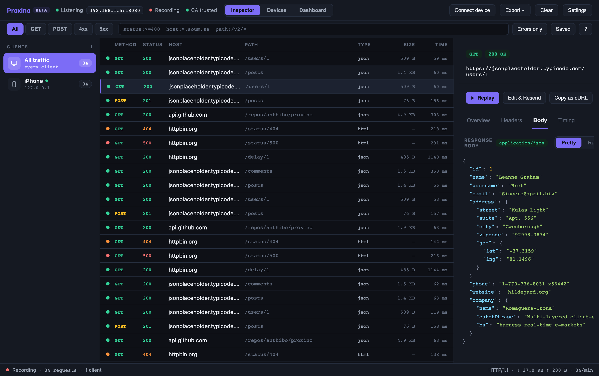
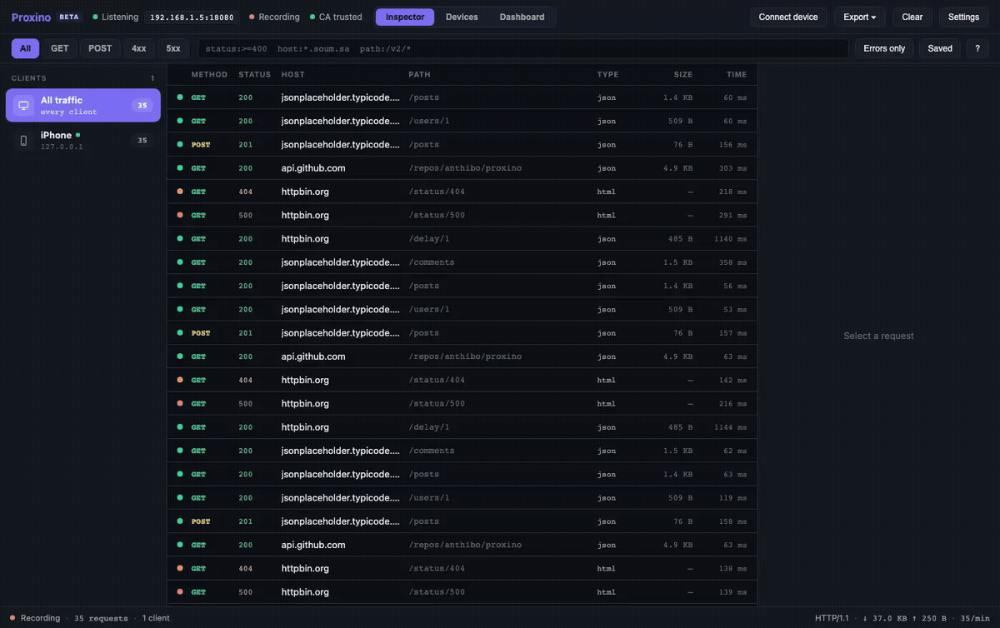

# Proxino

**A free, open-source network inspector for your phone.** Point an iOS or Android device at Proxino and watch its HTTPS traffic live — requests, responses, timings, grouped per device — with filters, a JSON/HTML viewer, replay, and edit-and-resend. A self-hosted alternative to Proxyman and Charles: no account, no license, runs entirely on your machine.

<p align="center"></p>

<p align="center"></p>

> ⚠️ **It's a man-in-the-middle tool by design.** Use it only on devices and traffic you own or are authorized to inspect. The web UI binds to `127.0.0.1` only.

---

## Install

### Desktop app (recommended)

Download from the [latest release](https://github.com/anthibo/proxino/releases/latest):

| Platform | File | First launch |
|---|---|---|
| macOS 12+ (Apple Silicon) | `Proxino_<version>_aarch64.dmg` | Unsigned build: right-click **Proxino.app → Open**, or `xattr -dr com.apple.quarantine /Applications/Proxino.app` |
| Windows 10/11 (x64) | `Proxino_<version>_x64-setup.exe` | SmartScreen → **More info → Run anyway** |
| Linux (x64) | `.AppImage` or `.deb` | AppImage: `chmod +x Proxino_*.AppImage && ./Proxino_*.AppImage` |

The app bundles the capture engine — no Python or Node needed. It uses port 8080 for the proxy and 8081 for the UI, falling back to free ports if those are taken (the Connect-device wizard always shows the real one).

### Web UI via pip

```bash
pipx install proxino     # or: pip install proxino
proxino                  # proxy on :8080, opens http://127.0.0.1:8081
```

`proxino --proxy-port 9090 --web-port 9091` changes the ports; any other flag is passed to `mitmdump`.

### From source

```bash
git clone https://github.com/anthibo/proxino && cd proxino
python3 -m venv .venv && .venv/bin/pip install -e .
cd web && npm install && npm run build && cd ..
.venv/bin/proxino
```

---

## Why Proxino instead of Proxyman / Charles?

| | Proxino | Proxyman | Charles |
|---|---|---|---|
| Price | Free, MIT | Paid license (free tier limited) | Paid license |
| Source | Open | Closed | Closed |
| Runs on | macOS · Windows · Linux · any browser | macOS · Windows · iOS | macOS · Windows · Linux |
| UI | Web UI, also hosted in a native window | Native | Native (Java) |
| Engine | mitmproxy | Proprietary | Proprietary |
| Breakpoints / intercept | Not yet ([roadmap](#roadmap)) | Yes | Yes |

Proxino is younger and smaller. If you need scripting, breakpoints, or map-local today, the paid tools still do more. If you want a free, hackable inspector that treats your phone as a first-class client, that's Proxino.

---

## Features

- **Live capture** of HTTP/HTTPS flows, streamed to the browser over WebSocket.
- **Per‑device grouping** — clients are auto‑named from the User‑Agent (iPhone, Android app, Mac…) with per‑device request counts; rename any device inline.
- **Filter DSL** — `status:>=400 host:*.example.com path:/v2/*`, with autocomplete, quick method chips (All/GET/POST/4xx/5xx), an "Errors only" toggle, and saved filters.
- **Rich response viewer** — collapsible syntax‑highlighted JSON, HTML/XML highlighting with a rendered Preview, line numbers, content‑type badge, and an error banner for 4xx/5xx.
- **Detail pane** — Overview (client, remote address, protocol/TLS, timing), Headers, Body, and a Timing waterfall.
- **Replay & Edit‑and‑Resend** — one‑click replay of a captured request, or open the editor to tweak method/URL/headers/body and send it as a new flow.
- **Copy as cURL**, **HAR export**, and **session save/load** (Proxino JSON).
- **Connect‑device wizard** with the proxy address and a scannable QR code for the CA certificate.

---

## How it works

```
        ┌────────────┐        ┌──────────────────────────────┐
 phone  │  mitmproxy  │  flows │  Proxino addon                │
 ───────▶  (:8080)     ├────────▶  • in‑memory flow store       │
 HTTPS  │  TLS decrypt │        │  • ClientRegistry (devices)   │
        └────────────┘        │  • FastAPI app  (:8081)        │
                              │      REST + WebSocket           │
                              │      serves web/dist            │
                              └───────────────┬───────────────┘
                                              │ HTTP/WS
                                     ┌────────▼────────┐
                                     │  React web UI    │  http://127.0.0.1:8081
                                     └─────────────────┘
```

- **`proxino/`** — the mitmproxy addon (`addon.py`), flow model + store, client/device registry, the FastAPI server (`server.py`), and helpers (HAR, sessions, CA info, transform).
- **`web/`** — the Vite + React + TypeScript UI (Zustand store, filter DSL, JSON viewer, etc.).

See [`docs/architecture.md`](docs/architecture.md) for a deeper tour.

---

## Connecting a device

1. Put the phone on the **same Wi‑Fi** as this machine.
2. Set a **manual HTTP proxy** to this machine's LAN IP, port **8080**
   (the Connect‑device wizard in the UI shows the exact address).
   - **iOS:** Settings → Wi‑Fi → (i) → Configure Proxy → Manual
   - **Android:** Wi‑Fi → long‑press network → Modify → Proxy → Manual
3. **Install and trust the CA** so HTTPS can be decrypted:
   - Open **http://mitm.it** on the device (through the proxy) and install the cert.
   - **iOS also needs:** Settings → General → About → **Certificate Trust Settings** → enable full trust. *(This step is easy to miss and is the usual cause of "no requests show up".)*

Some apps use certificate pinning and will refuse the proxy's cert — those show up as `Client TLS handshake failed` in the log and can't be decrypted. That's expected.

---

## Development

```bash
# Backend tests
.venv/bin/python -m pytest

# Frontend unit tests + type‑check
cd web && npm test && npx tsc --noEmit

# End‑to‑end (Playwright, against a mock server)
cd web && npx playwright test

# Live‑reloading UI (proxy the dev server's API/WS to :8081)
cd web && npm run dev
```

Project layout:

```
proxino/        mitmproxy addon + FastAPI backend (Python)
web/            React + TypeScript web UI (Vite)
tests/          backend tests (pytest)
web/tests/      frontend unit tests (vitest)
web/e2e/        end‑to‑end tests (Playwright)
docs/           documentation
```

---

## Configuration

| What            | Default            | Notes                                            |
|-----------------|--------------------|--------------------------------------------------|
| Proxy port      | `8080`             | `--proxy-port <n>`                               |
| Web UI port     | `8081`             | `--web-port <n>` (loopback only)                 |
| Max flows       | `5000` in memory   | oldest evicted first                             |
| CA certificate  | `~/.mitmproxy/`    | generated by mitmproxy on first run              |

---

## Roadmap

- Breakpoints / intercept-and-edit before forwarding
- Find-in-body search, copy-all-as-cURL
- Signed and notarized desktop builds, Intel macOS build, Homebrew tap
- Client-side scripting hooks

Ideas and PRs welcome — see [CONTRIBUTING.md](CONTRIBUTING.md).

---

## License

[MIT](LICENSE) © Abdulrahman Khalid
