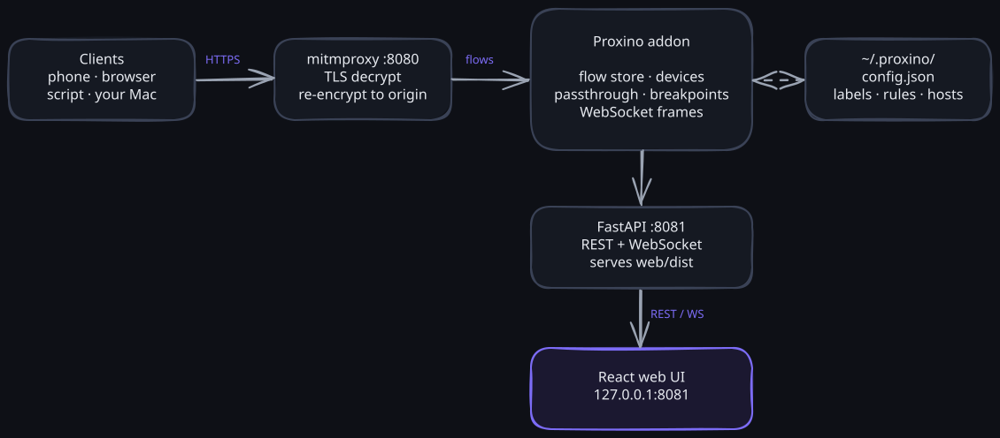

# Architecture

Proxino has three layers: a **mitmproxy addon** that captures traffic, a **FastAPI backend** that exposes it, and a **React web UI** that renders it. All three run in one process on `127.0.0.1`; a desktop shell (`desktop/`, Tauri) bundles that process as a native app.

<p align="center"></p>

> The diagram is editable: open [`architecture.excalidraw`](architecture.excalidraw) in [Excalidraw](https://excalidraw.com) and re‑export `media/architecture.svg`.

## 1. Capture — the mitmproxy addon (`proxino/addon.py`)

Proxino runs as a standard mitmproxy addon loaded by `mitmdump`. mitmproxy terminates TLS with its own CA and re‑encrypts to the origin, so decrypted flows are available to the addon's hooks.

- On `request` a pending row is streamed (`flow.new`); on `response` / `error` the addon converts the mitmproxy `HTTPFlow` into a plain `Flow` record (`transform.py`) and stores it in an in‑memory ring buffer (`store.py`, capped at 5000, oldest evicted), broadcasting `flow.complete` / `flow.error`.
- Original mitmproxy flow objects are retained (bounded) so **Replay** and **Edit‑and‑Resend** can re‑issue them; the edit logic lives in `apply_request_edits` / `apply_response_edits`.
- When mitmproxy finishes starting (`running` hook), the addon boots the FastAPI app on a uvicorn server bound to `127.0.0.1`, and starts a 1 s breakpoint sweep task.

`cli.py` translates Proxino's own flags (`--proxy-port` / `--web-port`, env `PROXINO_*`) into `mitmdump` argv and always loads the addon. `paths.py` resolves the built UI and the addon across dev, PyPI wheel, and frozen (PyInstaller) layouts.

### TLS passthrough for pinned hosts (`passthrough.py`)

Cert‑pinned apps drop the handshake rather than trust the proxy's cert. The `tls_failed_client` hook feeds a `PassthroughRegistry` that counts failures per SNI host; after two within a minute the host flips to passthrough. The `tls_clienthello` hook then sets `ignore_connection` for that host, so mitmproxy forwards it encrypted and untouched — the app keeps working, no HTTP flow is produced, and the host is surfaced via `passthrough.update`. Known hosts can be pre‑listed under `"passthrough_hosts"` in `~/.proxino/config.json`.

### Breakpoints (`breakpoints.py`)

`BreakpointEngine` matches structured rules (host / path / method / phase, fnmatch globs) and pauses matching flows with `flow.intercept()` in the `request` / `response` hooks — but never for replays and never while no UI client is connected (`Broadcaster.client_count() == 0`), so an armed rule can't strand a device. A paused flow's record carries state `paused_request` / `paused_response`; `resume_paused` applies edits and continues, `drop_paused` kills it. A 1 s sweep auto‑continues anything paused longer than 60 s. Rules live under `"breakpoints"` in `~/.proxino/config.json`.

### WebSocket frames (`wsstore.py`)

The `websocket_start` / `websocket_message` / `websocket_end` hooks mark the flow `kind: "ws"` and append each frame to a per‑connection capped buffer (`WsStore`, 500 frames) with a lightweight text / JSON / MsgPack / Protobuf preview. Frames stream as `ws.message` events; a throttled `flow.update` keeps the row's frame count fresh.

### Body decoders (`decode.py`)

`decode_body` renders Protobuf, gRPC (schema‑less), MsgPack, multipart, and URL‑encoded bodies via mitmproxy's content views, size‑guarded so a large body never stalls the hot hook path. The result is stored on the record as `body_view` (a short label) and `body_pretty`.

### Device detection (`clients.py`)

`ClientRegistry.device_for(ip, user_agent)` returns a `(label, kind)` pair and remembers the first device *kind* seen per IP, recognising browsers and native app HTTP stacks (`CFNetwork`/`Darwin` → iOS app, `okhttp`/`Dalvik` → Android app). Labels, passthrough hosts, and breakpoint rules are persisted atomically to `~/.proxino/config.json` with a read‑modify‑write that preserves the other keys.

## 2. API — the FastAPI backend (`proxino/server.py`)

`make_app(store, registry, broadcaster, ...)` builds the app. Key endpoints:

| Method | Path                              | Purpose                                     |
|--------|-----------------------------------|---------------------------------------------|
| GET    | `/api/flows`                      | flow list (metadata, no bodies)             |
| GET    | `/api/flows/{id}`                 | full flow detail (headers + bodies)         |
| GET    | `/api/flows/{id}/ws`              | WebSocket frames for a `ws` flow (paged)    |
| DELETE | `/api/flows`                      | clear the store                             |
| GET/PUT | `/api/clients` · `/api/clients/{ip}` | per‑device counts + kind · rename       |
| POST   | `/api/flows/{id}/replay` · `/replay-edited` | replay, or replay with edits       |
| GET/DELETE | `/api/passthrough` · `/api/passthrough/{host}` | passed‑through hosts · retry decrypt |
| GET/PUT | `/api/breakpoints`               | breakpoint rules + enabled toggle           |
| GET    | `/api/paused`                     | currently paused flows (with a snapshot)    |
| POST   | `/api/paused/{id}/resume` · `/drop` | continue (with optional edits) · drop     |
| GET    | `/api/export/har`                 | HAR 1.2 export                              |
| GET/POST | `/api/session`                  | save / load a Proxino JSON session          |
| GET    | `/api/connect-info` · `/api/ca-info` | proxy address · CA fingerprint           |
| WS     | `/ws`                             | live event stream                           |

The built web UI (`web/dist`) is mounted at `/` when present. Endpoints that publish (resume, drop, clear) are `async def` so they run on mitmproxy's own asyncio loop — the addon and API share one event loop and one store, so a publish from an HTTP handler reaches the same broadcaster.

**WebSocket events:** `flow.new` / `flow.complete` / `flow.error` / `flow.update`, `ws.message`, `passthrough.update`, and `breakpoint.paused` / `resumed` / `dropped` / `timeout` / `breakpoints.update`.

## 3. UI — the React app (`web/`)

- **State:** a Zustand store (`store.ts`) holds the flow map, selection, active filter/client, and the passthrough / breakpoints / paused / WebSocket‑frame collections. `visibleFlows()` applies the parsed filter + client selection.
- **Live updates:** the WebSocket client in `App.tsx` auto‑reconnects and calls `resync()` (flows, passthrough, breakpoints, paused, and the selected ws flow's frames) on reconnect.
- **Filter DSL:** `filters/dsl.ts` parses queries like `status:>=400 host:*.soum.sa path:/v2/*` (plus `type:ws`) into a predicate; `filters/suggest.ts` powers autocomplete.
- **Viewers:** `JsonView` renders a collapsible, syntax‑highlighted tree plus a line‑numbered raw view, a format badge for decoded bodies, and a sandboxed Preview iframe; `WsMessages` streams WebSocket frames; `Timing` draws the per‑phase waterfall.
- **Components** map to UI regions: `TopBar`, `FilterBar`, `ClientsSidebar`, `FlowTable`, `DetailPane`, `StatusBar`, the `Devices` and `Dashboard` views, and modals (`ConnectDeviceModal`, `ReplayModal`, `Settings`, `BreakpointsModal`); paused flows edit inline via `PausedEditor` (sharing `HeaderRowsEditor` with `ReplayModal`).

## Data model (`proxino/models.py`)

A `Flow` carries request/response metadata, a `ClientRef` (ip, label, kind), `server_addr`, `tls_version`, a `Timing` breakdown (connect / TLS / TTFB / download), a `kind` (`http` / `ws`) with a `ws` summary, and a `modified` flag set when a breakpoint edit was applied. Request/response bodies carry `body_view` / `body_pretty` from the decoders. `Flow.meta()` returns the list‑view projection (bodies stripped) used by `/api/flows` and the WebSocket events.

## Desktop shell (`desktop/`)

A Tauri 2 app bundles the Python backend as a PyInstaller sidecar. On launch it picks free ports (proxy prefers 8080, UI 8081), spawns the sidecar, waits for the UI port, and loads it in a native window, killing the sidecar on exit. Releases are built for macOS, Windows, and Linux by the tag‑triggered `.github/workflows/release.yml`.

## Data & event flow — worked examples

Each example follows one request through the hooks, the store, and the `/ws` event stream. Records are the `Flow.meta()` projection the list view and events carry; the full detail (with bodies) comes from `GET /api/flows/{id}`.

### 1. A decrypted GET

A phone requests `https://api.soum.sa/v2/listings`.

1. `request` hook fires. The addon builds a pending record and publishes it, so the row appears before the response lands:

   ```json
   { "type": "flow.new", "flow": {
       "id": "a1b2", "method": "GET", "scheme": "https", "host": "api.soum.sa",
       "path": "/v2/listings", "client": { "ip": "192.168.1.29", "label": "Anthibo iPhone", "kind": "phone" },
       "kind": "http", "state": "pending", "response": null } }
   ```

2. `response` hook fires. The record is completed (status, sizes, per‑phase timing, decoded `body_view` if any) and re‑published:

   ```json
   { "type": "flow.complete", "flow": {
       "id": "a1b2", "response": { "status": 200, "content_type": "application/json", "size": 3120, "body_view": null },
       "state": "complete", "duration_ms": 142 } }
   ```

3. The UI upserts the row on each event (same `id`, no reordering). Clicking it calls `GET /api/flows/a1b2` for headers and the body; a Protobuf/gRPC/MsgPack body arrives pre‑rendered as `body_pretty` with a `body_view` badge.

### 2. A WebSocket connection

The app opens `wss://gateway.example.com/socket`.

1. The HTTP `101` upgrade is captured like any flow. `websocket_start` marks it `kind: "ws"` and publishes a `flow.update`; the row shows a live `ws` badge instead of a status.
2. Each frame triggers `websocket_message`. The frame is appended to the per‑connection `WsStore` (capped 500) with a preview and streamed:

   ```json
   { "type": "ws.message", "flow_id": "c3d4",
     "message": { "i": 0, "dir": "out", "type": "text", "size": 48, "view": "json",
                  "text": "{\"op\":\"subscribe\",\"topic\":\"orders\"}", "pretty": "{\n  \"op\": \"subscribe\", …" } }
   ```

   A throttled `flow.update` (≤ 4/s) keeps the row's frame count fresh. `websocket_end` publishes a final `flow.update` with the close code. The Messages tab loads history from `GET /api/flows/c3d4/ws?after=N` and appends live frames, merging by index so nothing is lost across a reconnect.

### 3. A pinned host (passthrough)

Instagram refuses the proxy's certificate.

1. `tls_failed_client` fires. `PassthroughRegistry.record_failure("i.instagram.com", …)` counts it and publishes the current set with the host `"active": false` — it is **watching**, still intercepted while the count builds:

   ```json
   { "type": "passthrough.update", "hosts": [
       { "host": "i.instagram.com", "source": "auto", "active": false, "failures": 1, "clients": ["192.168.1.29"] } ] }
   ```

2. On the second failure within a minute the host flips to `"active": true`. From then on `tls_clienthello` sets `ignore_connection`, so mitmproxy forwards that host encrypted and untouched — the app works, **no HTTP flow is produced for it**, and it's listed under Passthrough. `DELETE /api/passthrough/i.instagram.com` retries decryption; a config‑listed host is active from the first hello and skips the two failures.

### 4. A breakpoint (pause → edit → continue)

A rule is armed: host `endpoint.soum.sa`, phase `request`.

1. A matching `request` pauses **only if a UI client is connected**. `BreakpointEngine.pause` calls `flow.intercept()` (mitmproxy holds the request), the record goes to `state: "paused_request"`, and two events fire:

   ```json
   { "type": "flow.update", "flow": { "id": "e5f6", "state": "paused_request" } }
   { "type": "breakpoint.paused", "entry": { "flow_id": "e5f6", "phase": "request",
       "rule_id": "r1", "since": 1757000000, "deadline": 1757000060 }, "flow": { "…full detail…" } }
   ```

2. The row jumps to a **Paused** group; the inline editor loads the detail. `POST /api/paused/e5f6/resume` with `{ "headers": [["x-debug","1"], …] }` runs on the event loop: `apply_request_edits` rewrites the retained mitmproxy flow, `flow.resume()` lets it continue to the origin, and the record is marked `modified: true`. The normal `response` hook then completes it as usual. `breakpoint.resumed` (or `breakpoint.dropped` for `POST …/drop`) clears it from the UI.
3. If no one acts within 60 s, the 1 s sweep auto‑continues it unchanged and publishes `breakpoint.timeout`. Clearing the store (`DELETE /api/flows`) also resumes anything paused, so a rule can never strand the device.
